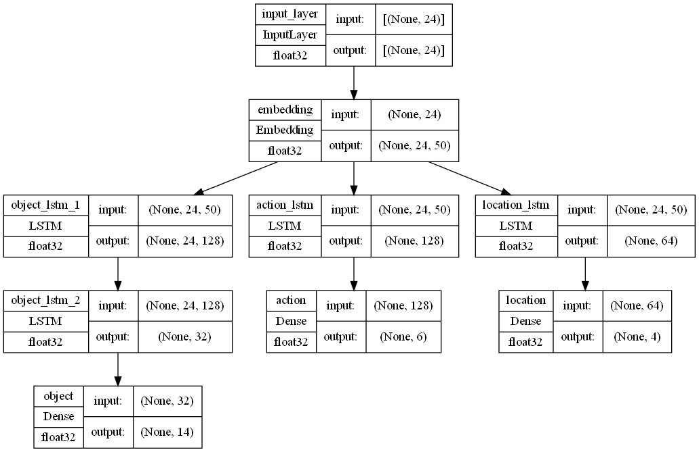
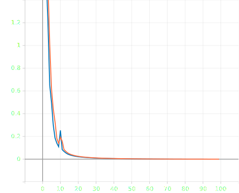

## Multi-Labeled Text Classifier
#### Natural Language Processing and Deep Neural Network

### Setting Up this Project on system:
1. Clone this repo `git clone https://github.com/rawat999/MultiLabelTextClassification.git`
2. change your directory into `cd MultiLabelTextClassification`
3. Download [dataset](https://drive.google.com/file/d/1slGtHKHYTtiuC98yomV0hP3C85Q5V8sg/view?usp=sharing)
4. Create Virtual Environment with following steps:
    - Make sure you have install python3.9
    - Upgrade pip: `python -m pip install --upgrade pip`
    - Check pip version: `py -m pip --version`
    - Install virtualenv package: `py -m pip install --user virtualenv`
    - Create virtualenv: `py -m venv env`
    - Activate venv: `.\env\Scripts\activate`
    - Deactivate venv (Optional if not want to use this venv): `.\env\Scripts\activate`
4. Extract the dataset into `data/` folder
5. Install dependencies using `pip install -r requirements.txt`
6. Train MultiClassifier module using command: `python train.py`
7. Evaluate Model: `python evaluation.py -d ./data/valid_data.csv`

### Model Architecture

#### Training Loss Curve

Ongoing Project...
